<h1 align="center">Лабораторная работа №2</h1>

<h2 align="center">Простейшие алгоритмы детектирования объектов</h2>


<h4>1. Template matching</h4>

<p align="center"><b>Теоритическая база</b><p>

Template matching — это метод нахождения эталона на исходном изображении. В библиотеке OpenCV для этих целей существует функция <b>cv.matchTemplate()</b>. Она пробегается по исходному изображению и накладывает на него эталон, в это время происходит сравнивнение эталона и фрагмента исходного изображения. В OpenCV реализовано несколько методов сравнения: 

<table>
    <tr>
        <td>TM_SQDIFF</td>
        <td>Square Difference Matching Method <br><i>Квадратная разность</i></td>
    </tr>
    <tr>
        <td>TM_SQDIFF_NORMED</td>
        <td>Normalized Square Difference Matching Method <br><i>Нормализованная квадратная разность</i></td>
    </tr>
    <tr>
        <td>TM_CCORR</td>
        <td>Cross-Correlation Matching Method<br><i>Кросс-корреляция</i></td>
    </tr>
    <tr>
        <td>TM_CCORR_NORMED</td>
        <td>Normalized Cross-Correlation Matching Method<br><i>Нормализованная кросс-корреляция</i></td>
    </tr>
    <tr>
        <td>TM_CCOEFF</td>
        <td>Correlation Coefficient Matching Method<br><i>Коэффициент корреляции</i></td>
    </tr>
    <tr>
        <td>TM_CCOEFF_NORMED</td>
        <td>Normalized Correlation Coefficient Matching Method<br><i>Нормализованный коэффициент корреляции</i></td>
    </tr>
</table>

<figure align="center">
  <p>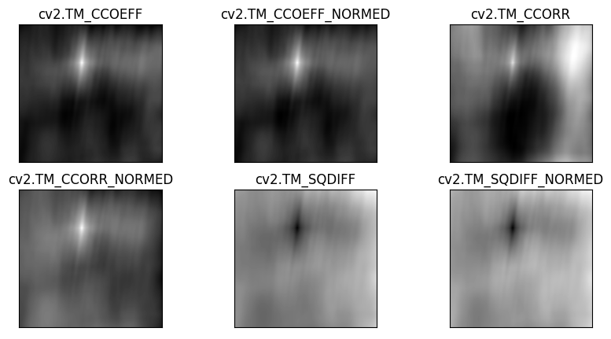</p>
  <figcaption><i>Карта вероятности составленная с помощью использования разных методов сравнения</i></figcaption>
</figure><br><br>

Функция возвращает изображение в градациях серого, где каждый пиксель обозначает, насколько пиксели фрагмента исходного изображения совпадают с эталоном. В зависимости от выбранного метода, максимальное/минимальное значение пикселя будет указывать на наиболее вероятное расположение левого угла эталона.

<p align="center"><b>Описание разработанной системы</b><p>
Принцип работы состоит из пяти этапов:

1) Загрузка изображений.
2) Создание карты вероятности расположения эталона на фрагменте исходного изображения.
3) Нахождение наиболее вероятной позиции для эталона.
4) Создание рамки для эталона на исходном изображении.
5) Вывод изображения после проведённых операций.

<b>Загрузка изображений</b>

Загружаем исходное изображение и вырезанный из него эталон (оба изображения форматируем в градации серого). 
```
img = cv2.imread('data/img1.jpg')
img_gray = cv2.cvtColor(img, cv2.COLOR_BGR2GRAY)
template = cv2.imread('data/img1.1.jpg', 0)
```
<figure align="center">
  <p>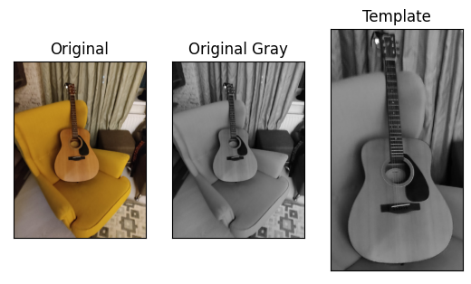</p>
  <figcaption><i>Исходное изображение и эталон</i></figcaption>
</figure><br><br>

<b>Создание карты вероятности расположения эталона на фрагменте исходного изображения</b>

Вызываем функцию <b>cv.matchTemplate()</b> с желаемым методом сравнения (я выбрал <b>TM_SQDIFF</b>). 

```
res = cv2.matchTemplate(img_gray, template, cv2.TM_SQDIFF)
```
<figure align="center">
  <p align="center">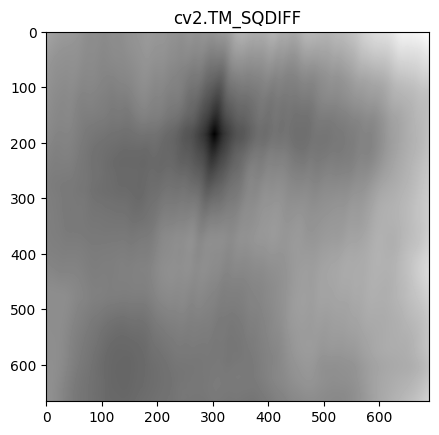</p>
</figure>
<p align="center"><i>Карта вероятности располажения эталона на исходном изображении</i></p><br><br>


<b>Нахождение наиболее вероятной позиции для эталона</b>

Нам необходимо на получевшемся изображении найти наиболее вероятную позицию. Для этого мы вызываем функцию <b>cv2.minMaxLoc()</b>. Функция возвращает четыре значения:
<ul>
    <li>minVal – значение минимального экстремума</li>
    <li>maxVal – значение максимального экстремума</li>
    <li>minLoc – позиция минимального экстремума</li>
    <li>maxLoc – позиция максимального экстремума</li>
</ul>

Так как мы использовали метод сравнения <b>TM_SQDIFF</b>, нас интересует только позиция минимального экстремума.

```
_, _, min_loc, _ = cv2.minMaxLoc(res)
```

<b>Создание рамки для эталона на исходном изображении</b>

В качестве верхнего левого угла рамки берём позицию минимального экстремума. Далее задаём правый нижний угол рамки и рисуем получившуюся рамку на исходном изображении.
```
top_left = min_loc 
bottom_right = (top_left[0] + template.shape[1], top_left[1] + template.shape[0])
cv2.rectangle(img_gray, top_left, bottom_right, 255, 2)
```
<b>Вывод изображения после проведённых операций</b>

Выводим на экран изображение с помощью встроенной функции opencv, дополнительно уменьшаем изобжение.
```
cv2.imshow("Result", cv2.resize(img_gray, dsize = (int(img.shape[1]/2.5),int(img.shape[0]/2.5))))
cv2.waitKey()
cv2.destroyAllWindows()
```

<figure>
  <p align="center">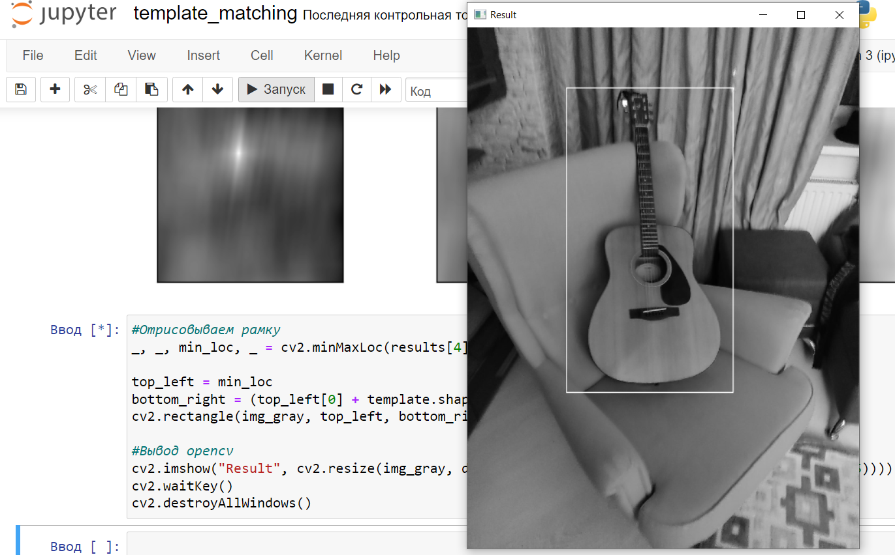</p>
  <p align="center"><figcaption><i>Вывод результата</i></figcaption></p>
</figure><br><br>

<h4>2. ORB</h4>

<p align="center"><b>Теоритическая база</b><p>

ORB (Oriented FAST and Rotated BRIEF) – это метод нахождения ключевых точек и вычисления их дескрипторов, на базе которых строятся соответсвия между эталоном и исходным изображением. Метод состоит из двух алгоритмов:

FAST (Features from Accelerated Segment Test) – алгоритм поиска ключевых точек. FAST пробегается по изображению и вокруг каждого пикселя строит окружность с радиусом 3 пикселя. Сравнивая яркости пикселей, лежащих на линии окружности, с яркостью центра, получаем для каждого пикселя три возможных исхода (светлее, темнее, похоже). Точка помечается как ключевая, если на линии окружности существует подряд 12 пикселей, которые темнее, или 12 пикселей, которые светлее, чем центр.

<figure align="center">
  <p>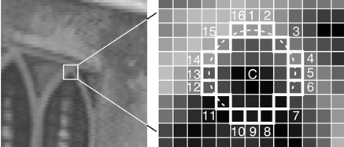</p>
  <figcaption><i>Алгоритм FAST</i></figcaption>
</figure><br><br>

BRIEF (Binary Robust Independent Elementary Features) – алгоритм вычисления дескрипторов. После того, как ключевые точки найдены, вычисляют их дескрипторы, т.е. наборы признаков, характеризующие окрестность каждой особой точки. Дескриптор, строится из 256-ти бинарных сравнений между яркостями пикселей на размытом изображении. 
Если говорить простыми словами BRIEF – это бинарное описание окрестностей точки. Рассмотрим изображение ниже, на нём сгенерирован произвольный "патч". Чтобы описать этот "патч" в бинарном виде, мы сравниваем пары точек: если вторая точка ярче чем первая то результатом сравнения будет "1", иначе "0".

<figure align="center">
  <p>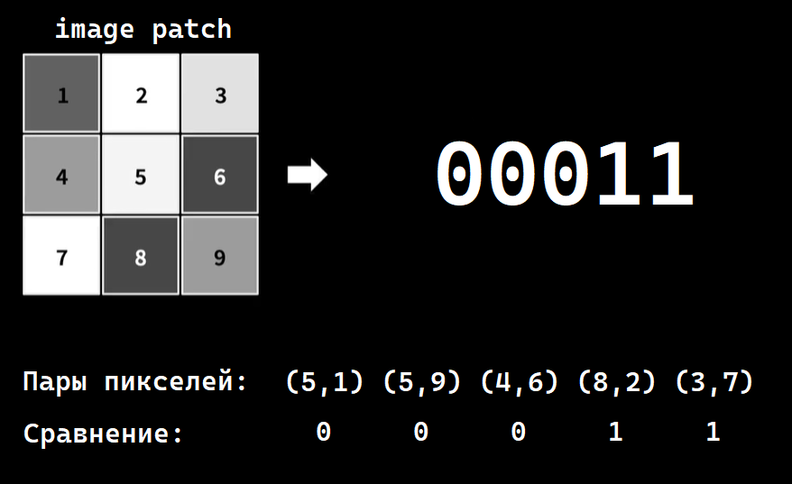</p>
  <figcaption><i>Алгоритм BRIEF</i></figcaption>
</figure><br><br>

Полученный бинарный дескриптор оказывается устойчив к сменам освещения, перспективному искажению, быстро вычисляется и сравнивается, но очень неустойчив к вращению в плоскости изображения.

<p align="center"><b>Описание разработанной системы</b><p>
Принцип работы состоит из пяти этапов:

1) Загрузка изображений.
2) Нахождение ключевых точек и вычисление их дескрипторов.
3) Нахождение соответсвий между дескрипторами двух изображений.
4) Создание рамки для эталона на исходном изображении.
5) Вывод изображения после проведённых операций.

<b>Загрузка изображений</b>

Загружаем исходное изображение и вырезанный из него эталон (оба изображения форматируем в градации серого).
```
template = cv2.imread('data/img1.1.jpg',cv2.IMREAD_GRAYSCALE)# Эталон
image = cv2.imread('data/img1.jpg',cv2.IMREAD_GRAYSCALE) # Сцена с эталоном
```
<figure align="center">
  <p></p>
  <figcaption><i>Исходное изображение и эталон</i></figcaption>
</figure><br><br>

<b>Нахождение ключевых точек и вычисление их дескрипторов</b>

Инициализируем объект ORB с помощью конструктора <b>cv2.ORB_create()</b>. 
Находим ключевые точки и вычисляем их дескрипторы для эталона и исходного изображения используя функцию <b>detectAndCompute()</b>.

```
orb = cv2.ORB_create()
kp_template, des_template = orb.detectAndCompute(template,None)
kp_image, des_image = orb.detectAndCompute(image,None)
```
<figure align="center">
  <p>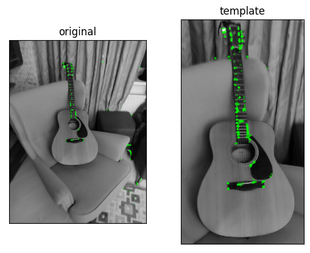</p>
  <figcaption><i>Ключевые точки на изображениях</i></figcaption>
</figure><br><br>

<b>Нахождение соответсвий между дескрипторами двух изображений</b>

Для нахождения соответсвий между дескрипторами инициализируем объект BFMatcher <b>cv2.BFMatcher()</b>. Первым параметром указываем, что будем высчитывать расстояние Хэмминга между дескрипторами двух массивов. Вторым параметром включаем перекрёстную проверку, это позволит улушить результат поиска соответсвий.

```
bf = cv2.BFMatcher(cv2.NORM_HAMMING, crossCheck=True)
```
Производим нахождение соответсвий <b>bf.match()</b> и сортируем результат по возрастанию дистанции Хэмминга (чем меньше дистанция, тем лучше соответсвие).
```
matches = bf.match(des_template,des_image)
matches = sorted(matches, key = lambda x:x.distance)
```
<figure align="center">
  <p>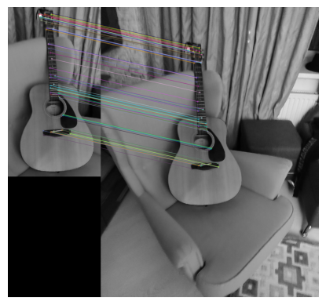</p>
  <figcaption><i>Визуализация соответсвий</i></figcaption>
</figure><br><br>

<b>Создание рамки для эталона на исходном изображении</b>

Чтобы нарисовать рамку будем использовать гомографию. Для начала потребуется сделать два массива точек для эталона и исходного изображения, опираясь на найденые соответсвия (я взял первые 10 самых лучших соответсвий).
```
src_pts = np.float32([ kp_template[m.queryIdx].pt for m in matches[:10] ]).reshape(-1,1,2)
dst_pts = np.float32([ kp_image[m.trainIdx].pt for m in matches[:10] ]).reshape(-1,1,2)
```
Далее, рассчитаем матрицу гомографии с помощью функции <b>cv2.findHomography()</b>.
```
h, _ = cv2.findHomography(src_pts, dst_pts)
```
Создадим массив из 4 угловых точек эталона и трансформируем их координаты используя функцию <b>cv2.perspectiveTransform()</b>. Данные координаты можно считать углами рамки на исходном изображении.

```
rectangle_pts = np.float32([[0, 0], 
                            [0,template.shape[0]],
                            [template.shape[1],0],
                            [template.shape[1],template.shape[0]]]).reshape(-1,1,2)

rectangle_pts = cv2.perspectiveTransform(rectangle_pts,h).reshape(-1,2)
```
После ряда косметиеских оперций рисуем прямоугольник.
```
result = image.copy()
cv2.rectangle(result, left_top, right_bottom, 255, 10)
```
<b>Вывод изображения после проведённых операций</b>

Выводим на экран изображение с помощью встроенной функции opencv, дополнительно уменьшаем изобжение.
```
cv2.imshow("Result", cv2.resize(result, dsize = (int(image.shape[1]/2.5),int(image.shape[0]/2.5))))
cv2.waitKey()
cv2.destroyAllWindows()
```

<p align="center"><figure>
  <p>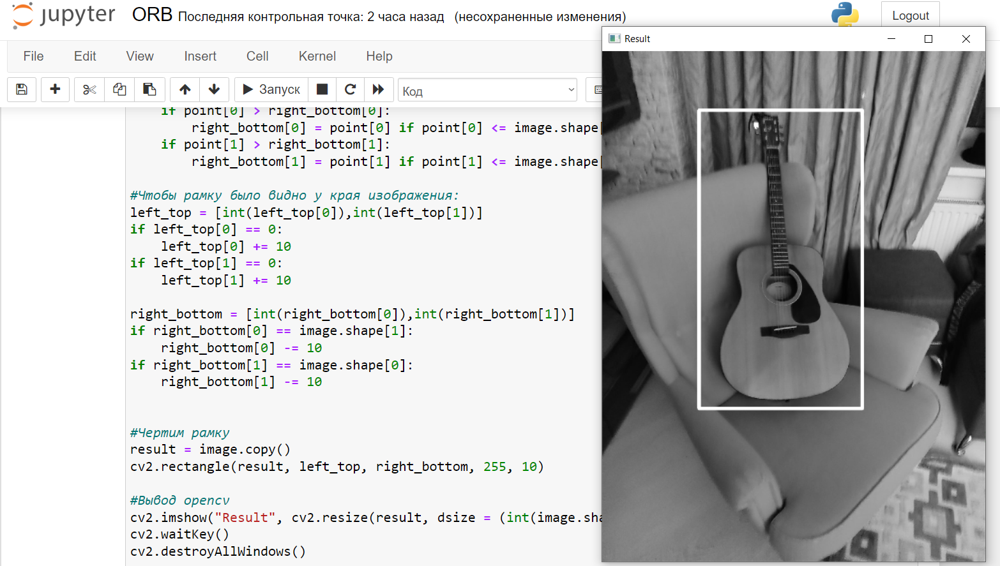</p>
  <figcaption><i>Вывод результата</i></figcaption>
</figure><br><br></p>

<h4 align="center">Результаты работы и сравнения системы</h4>
Для теста алгоритмов детектирования буду использовать следующий датасет:
<figure align="center">
  <p>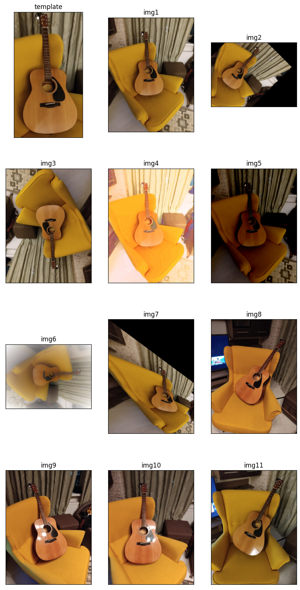</p>
  <figcaption><i>Датасет</i></figcaption>
</figure><br>

Начнём тестирование с <b>Template matching</b>:

<figure align="center">
  <p>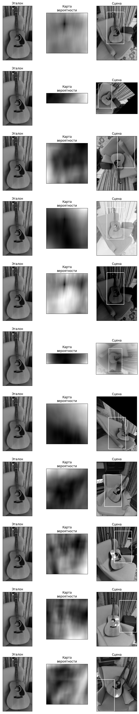</p>
  <figcaption><i>Результаты тестов</i></figcaption>
</figure><br>

На тестах видно, что алгоритм template matching смог предсказать 3 из 11 изображений верно. Опираясь на тесты можем сказать что алгоритм устойчев к изменени яркости и затемнению изображения.

Следующий алгоритм это <b>ORB</b>:

<figure align="center">
  <p></p>
  <figcaption><i>Результаты тестов</i></figcaption>
</figure><br>

ORB справился с тестами гораздо лучше чем template matching. Алгоритм правильно предсказал 8 из 11 изображений. Рассматривая тесты видно, что алгоритм очень неустойчив к вращению в плоскости изображения, однако отлично справляется со сменой освещения, поворотами и перспективному искажению. Это свзано с тем, что при изменении ракурса съёмки, сильно меняются дескрипторы ключевых точек и соответсвия между изображениями становятся менее точными.

<figure align="center">
  <p>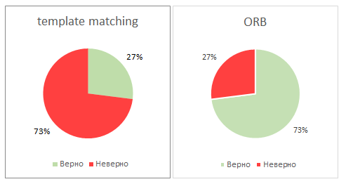</p>
  <figcaption><i>Сравнение точности алгоритмов</i></figcaption>
</figure><br>

<h4 align="center">Выводы по работе</h4>
Вывод: Рассмотрев два алгоритма детекции изображения, делаем вывод, что ORB намного лучше match template, потому что это более гибкий алгоритм. ORB работает опираясь на ключевые точки и дескрипторы, а значит его зависимость от освещения, поворотам изображения и перспективному искажению сведена к миниму. Однако оба алгоритма не смогли справится с вращением объекта в плоскости изображения, они не смогли найти гитару сфотографированную с сильно измененного ракурса.
